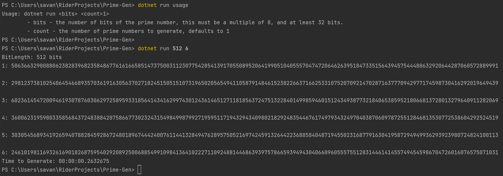

# Prime Number Generation


## Description
A program that generates large prime numbers using the C# parallel libraries given a bit length and count.
After each prime number is generated, the prime is printed to the console.

## Getting Started

### Dependencies
* .NET 6.0

### Installing
```
# Clone this repository
$ git clone https://github.com/sea7321/prime-number-generation.git

# Go into the repository
$ cd prime-number-generation
```

### Executing program

```
# Run the program
$ dotnet run <bits> <count>
```
* Bits - the number of bits of the prime number, this must be a multiple of 8, and at least 32 bits.
* Count - the number of prime numbers to generate, defaults to 1


## Author

Savannah Alfaro, sea2985@rit.edu